## 📊 Анализ потребительского поведения на основе данных из электронных чеков

<!-- 
Собрал и структурировал данные из 30+ чеков двух магазинов (PDF + HTML). Разработал парсер на Python (BeautifulSoup, pdfplumber), привёл данные к единому формату. С помощью Pandas провёл анализ: выделил сезонные и постоянные товары, выявил пиковые часы заказов, средний чек, популярность категорий. Результаты визуализировал в matplotlib/seaborn. Проект демонстрирует навыки ETL, работы с неструктурированными данными и аналитического мышления. 
-->

### 🎯 Цель проекта
Вместо скучных учебных датасетов (Титаник, ирисы Фишера) я решил проанализировать данные о своих покупках из двух интернет-магазинов: «Едоставка» и «Соседи». Это позволило не только изучить Pandas на живом примере, но и получить практические инсайты о собственном потребительском поведении. **После изучения на своих реальных данных я убрал даты и номера чеков и подмешал случайные товары, чтобы сохранить анонимность.**

---

### 📦 Источник данных
- **«Соседи»** — HTML-чеки (выгрузка с сайта)
- **«Едоставка»** — PDF-чеки (выгрузка с сайта)

**Объём данных:** ~86 чеков, 2173 строк

---

### 🛠️ Этапы работы

#### 1. Сбор и парсинг данных
Разработан парсер для двух форматов:
- **HTML** — извлечение структурированных данных через BeautifulSoup
- **PDF** — парсинг через pdfplumber с очисткой текста

**Особенности реализации:**
- Приведение обоих форматов к единой структуре (9 колонок)
- Извлечение веса/объёма единицы товара (например, `140г` → `140`, `0.93л` → `0.93`)
- Обработка исключений (`1/500` → `500г`, `1к` → `1кг`)
- Объединение данных из разных источников в единый CSV

#### 2. Очистка и подготовка данных (Pandas)
- Приведение типов (даты, числовые значения)
- Извлечение временных признаков (час, день недели, месяц)
- Категоризация товаров (молочка, овощи, фрукты, мясо, прочее)
<!-- - Создание признака «сезон» на основе месяца -->

#### 3. Анализ и визуализация

---
<!-- 
### Ключевые вопросы исследования

| Вопрос | Метрика | Инструмент |
|--------|---------|-------------|
| Что покупаю чаще всего? | Топ-10 товаров по частоте и сумме | `groupby()` + `nlargest()` |
| В какое время делаю заказы? | Распределение по часам | `groupby(час)` + гистограмма |
| Какой средний чек? | Агрегация по чеку | `groupby(файл)['Итого'].sum().mean()` |
| Какая категория самая популярная? | Доля категорий в сумме/количестве | `groupby(категория)` |
| Какие покупки сезонные? | Динамика по месяцам | сводная таблица + тепловая карта |
| А что покупаю всегда? | Постоянные товары (встречаются в >50% чеков) | `value_counts(normalize=True)` |
| В какое время заказы дороже? | Средняя сумма чека по часам | `groupby(час)['Сумма чека'].mean()` |
| Когда покупаю больше товаров? | Среднее кол-во позиций по часам | `groupby(час)['Товар'].count()` |
| Растут ли цены на товары? | Сравнение цены на один товар в разные даты | фильтр + `pivot_table()` |

--- -->


## Как скачать чеки используя веб-сайт магазинов
  

<br>

## Магазин - Едоставка

**Зайти в заказы, выбрать заказ, нажать иконку чека.**

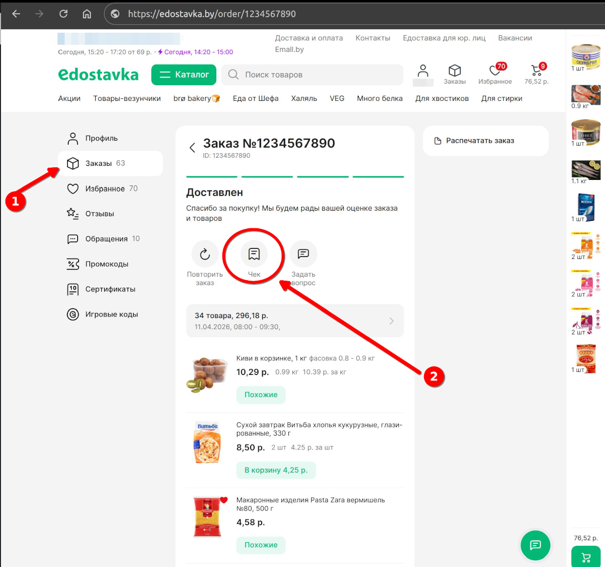

**Пример PDF чека**

<p align="center">
    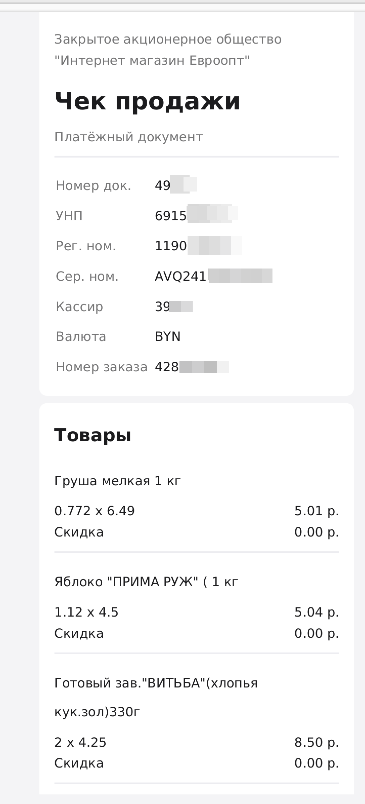
     &nbsp;&nbsp;&nbsp;
    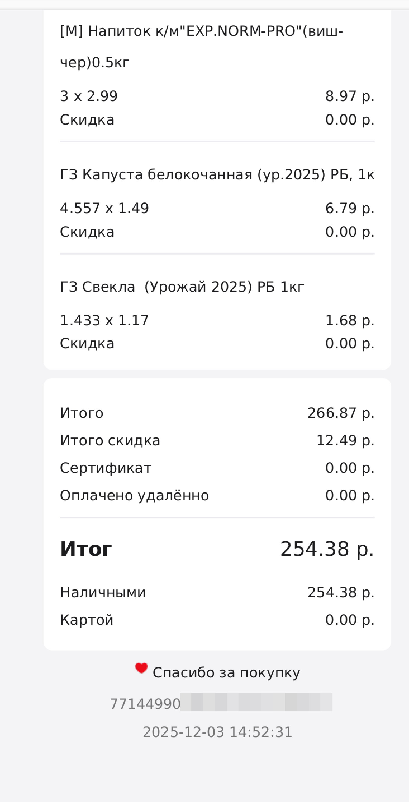
</p>

<br>

## Магазин - Соседи


**Зайти в мои покупки, выбрать заказ, нажать кнопку электронный чек.**

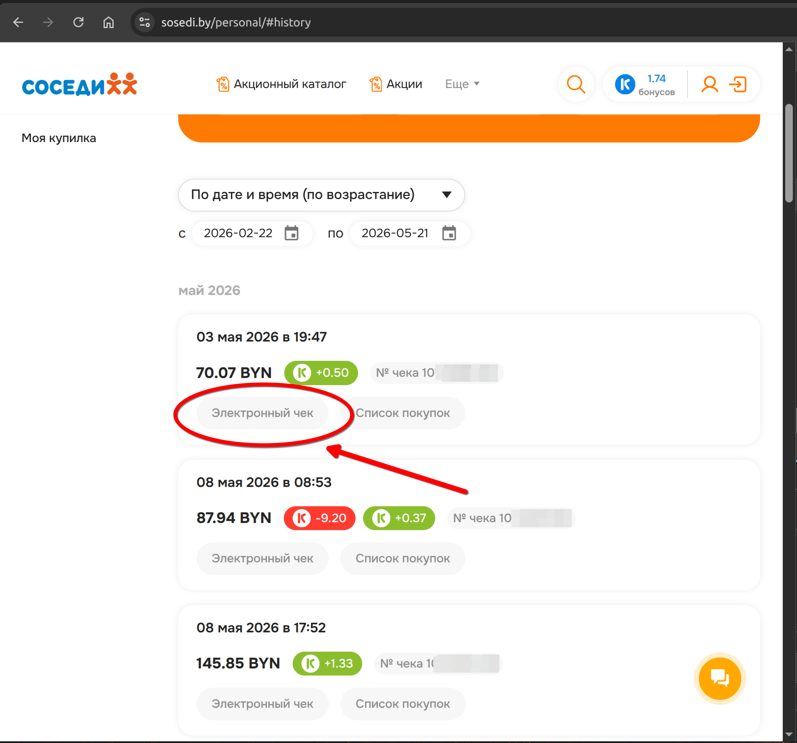

**Детали электронного чека в браузере.**

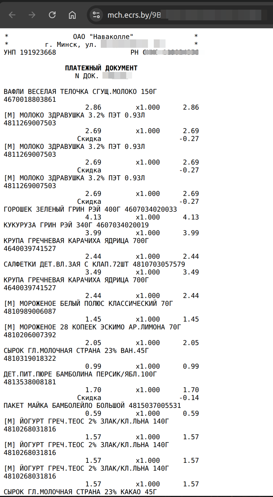

**Исходный код страницы**

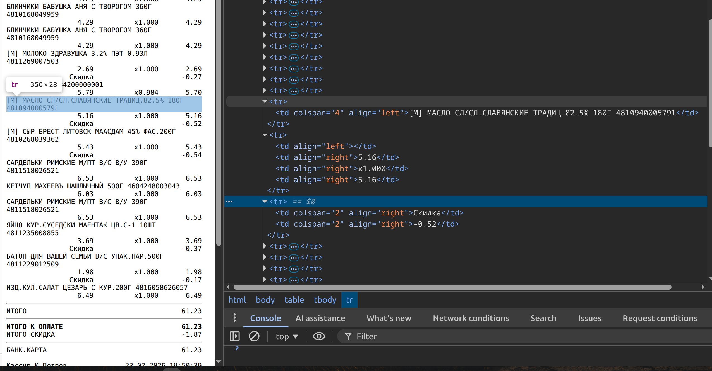

**Пример чека**

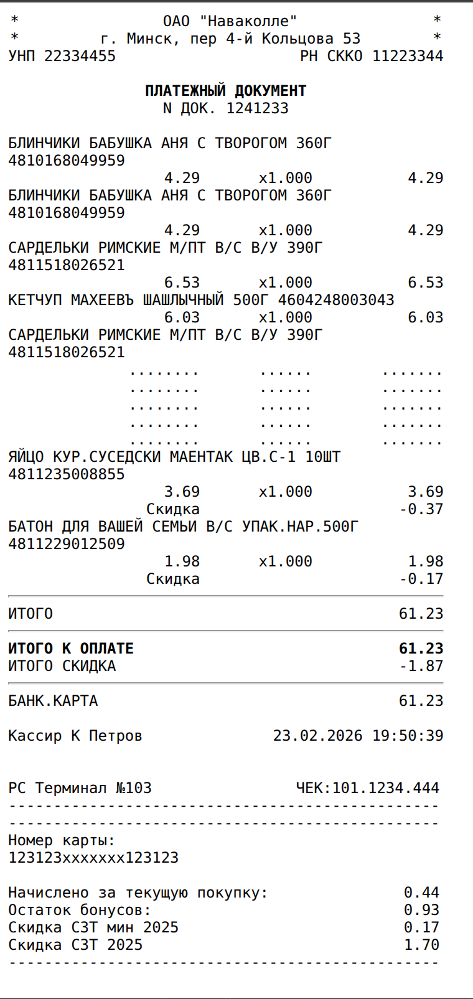

<br>
<br>

```html

    <tr>
        <td colspan="4" align="left">[М] МАСЛО СЛ/СЛ.СЛАВЯНСКИЕ ТРАДИЦ.82.5% 180Г 4810940005791</td>
    </tr>
    <tr>
        <td align="left"></td>
        <td align="right">5.16</td>
        <td align="right">x1.000</td>
        <td align="right">5.16</td>
    </tr>
    <tr>
        <td colspan="2" align="right">Скидка</td>
        <td colspan="2" align="right">-0.52</td>
    </tr>
    <tr>
        <td colspan="4" align="left">[М] СЫР БРЕСТ-ЛИТОВСК МААСДАМ 45% ФАС.200Г 4810268039362</td>
    </tr>
    <tr>
        <td align="left"></td>
        <td align="right">5.43</td>
        <td align="right">x1.000</td>
        <td align="right">5.43</td>
    </tr>
    <tr>
        <td colspan="2" align="right">Скидка</td>
        <td colspan="2" align="right">-0.54</td>
    </tr>

```


## 📊 Анализ данных

### Частота встречаемости категорий в чеках

Анализ показывает, как часто различные категории товаров появляются в чеках, и какие категории являются наиболее популярными.

**Процент присутствия категорий в чеках**

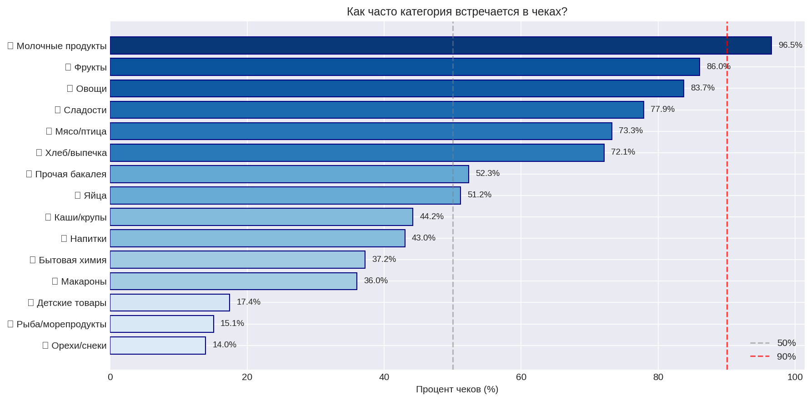

*График показывает долю чеков, в которых встречается каждая категория. Чем выше процент, тем более востребована категория. Пунктирные линии отмечают пороги в 50% и 90% для удобства оценки.*

### Тепловые карты заказов

Тепловые карты показывают, в какое время и в какой день наибольшее чилсло заказов. Чем темнее цвет, тем сильнее корреляция между категориями.

**Общая тепловая карта по всем чекам**

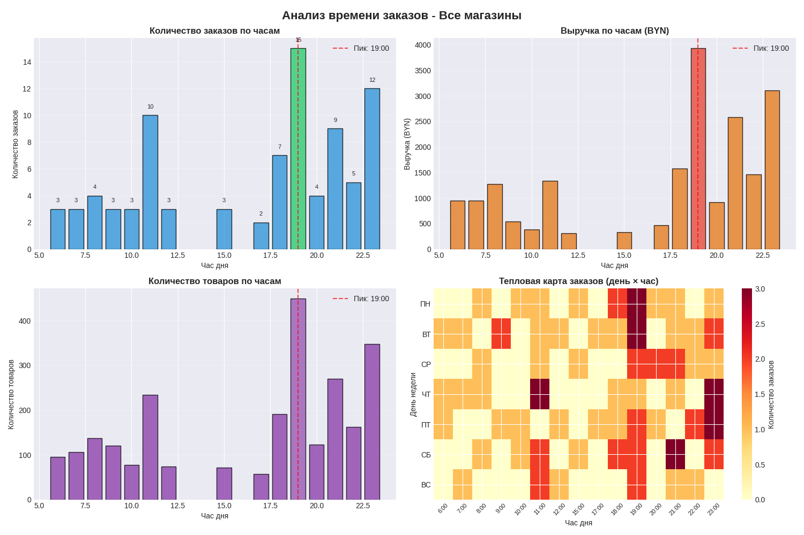

*Анализ всех чеков показывает глобальные паттерны совместных покупок. Высокая корреляция (тёмные ячейки) указывает на категории, которые часто приобретаются вместе.*

**Тепловая карта - Доставка (edostavka)**

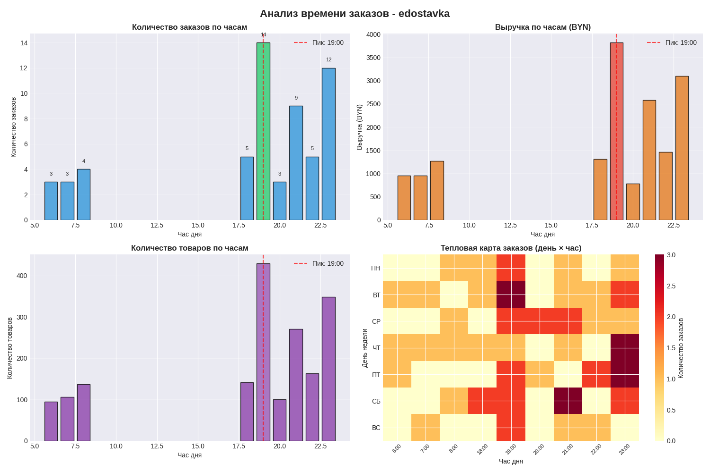

*Анализ чеков из сервиса доставки. Показывает специфические паттерны покупок при заказе с доставкой.*

**Тепловая карта - Соседи (sosedi)**

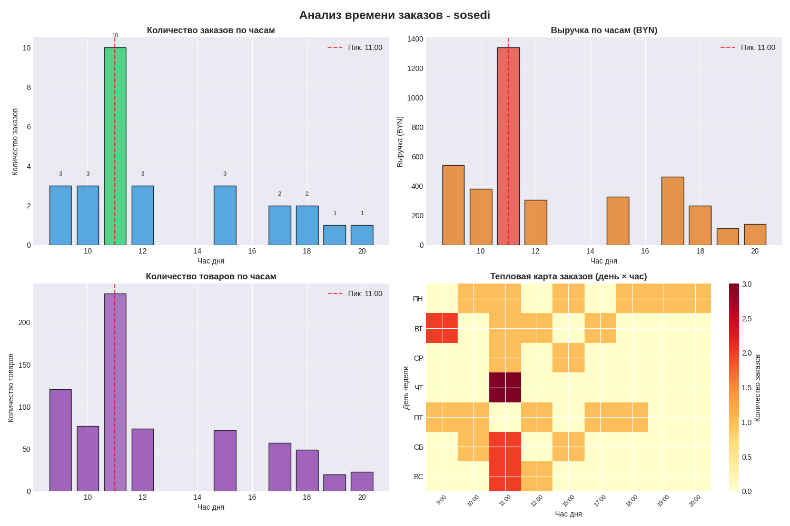

*Анализ чеков из магазинов "Соседи". Отражает особенности покупательского поведения в этой сети.*

### Популярные категории

**Топ наиболее популярных категорий**

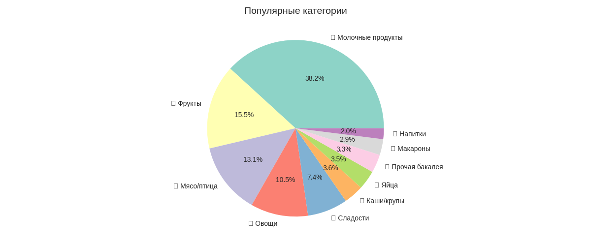

*Диаграмма показывает категории-лидеры по количеству покупок. Позволяет быстро определить самые востребованные товары.*


<br>
<br>
<br>
<br>

### Вывод

> *«На основе анализа 80+ чеков выяснилось, что большинство заказов доставки оформляются вечером, с 19 до 23 часов. Йогурты и молочная продукция — самая частотная категория (присутствует в 96% чеков)»*

<br>

### 🛠️ Используемый стек

| Компонент | Технологии |
|-----------|-------------|
| Парсинг PDF | `pdfplumber` |
| Парсинг HTML | `BeautifulSoup`, `re` |
| Обработка данных | `pandas`, `numpy` |
| Визуализация | `matplotlib`, `seaborn`, `plotly` |
| Среда | Jupyter Notebook / VS Code |

---

### Чему научился

- Обрабатывать неструктурированные данные из двух разных источников
- Писать регулярные выражения для извлечения числовых значений из текста
<!-- - Приводить данные к единому формату (ETL-процесс) -->
- Формулировать аналитические вопросы и находить на них ответы с помощью Pandas
- Создавать воспроизводимый пайплайн обработки данных

---